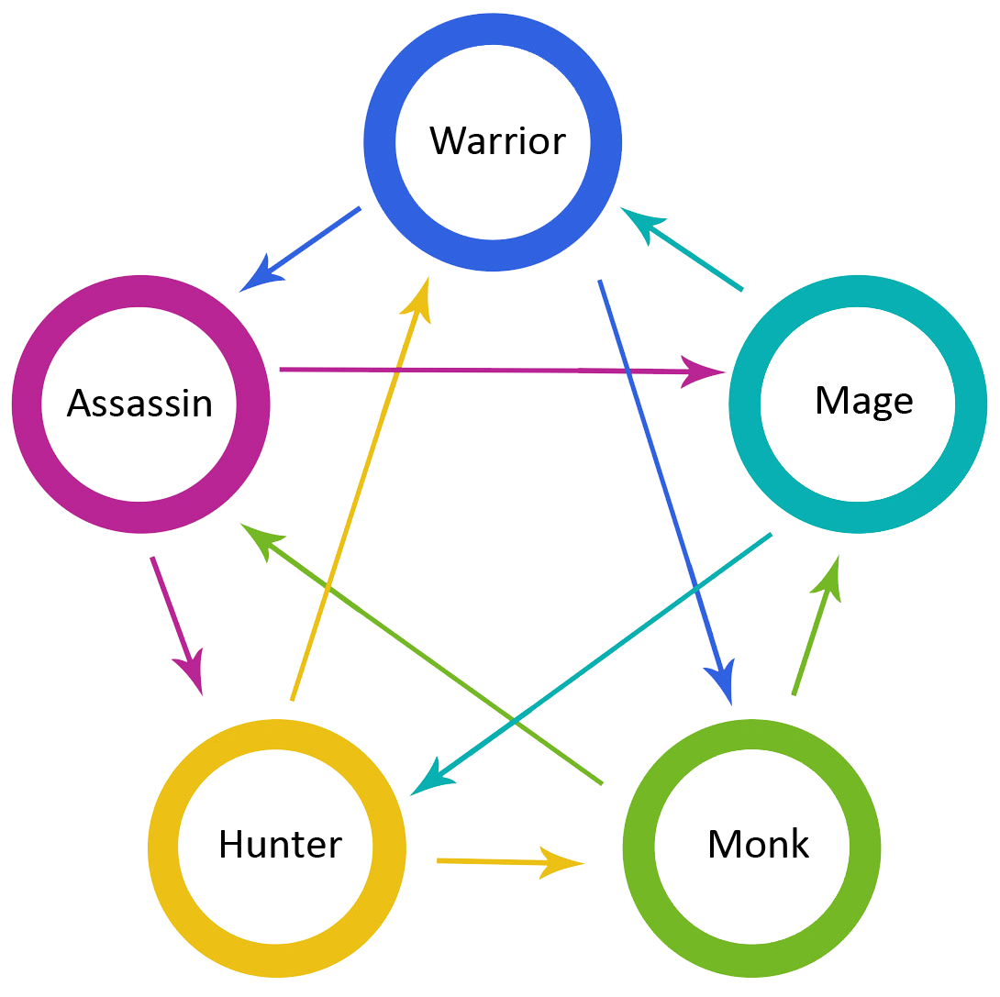

  

    

      <h1>How to play</h1>
      
The rule of the game is simple. You select 5 champions and then each champion fights against another random
        selected champion. If most of your champions win, you win. 

      

        Depending on the current game implementation, enemy champions may or may not be visible before a battle start,
        but they are always selected at random.
      

      
Your champions may be preselected at start, but you can select them manually. You can't select enemy champions.
      

      <h1>How it works</h1>
      
Main rule of the game is based on <a
          href="https://bigbangtheory.fandom.com/wiki/Rock,_Paper,_Scissors,_Lizard,_Spock" target="_blank"
          rel="noopener noreferrer">Rock Paper Scissors Lizard Spock</a> game, which is a five-weapon version of
        <a href="https://en.wikipedia.org/wiki/Rock_paper_scissors" target="_blank" rel="noopener noreferrer">Rock
          Paper Scissors</a> game.

      
Each Champion belongs to 1 of 5 classes. Each class wins agains 2 other classes, loses against other 2 and
        draws when fighting with the same class.  
      

      <ul>
        <li><strong>Warrior</strong>  
          draws against Warrior 
          wins against Assassin and Monk 
          lose against Mage and Hunter</li>
        <li><strong>Mage</strong>  
          draws against Mage 
          wins against Warrior and Hunter 
          lose against Assassin and Monk</li>
        <li><strong>Assassin</strong>  
          draws against Assassin 
          wins against Mage and Hunter 
          lose against Warrior and Monk</li>
        <li><strong>Hunter</strong>  
          draws against Hunter 
          wins against Warrior and Monk 
          lose against Mage and Assassin</li>
        <li><strong>Monk</strong>  
          draws against Monk 
          wins against Assassin and Mage 
          lose against Warrior and Hunter</li>
      </ul>
      <h5>Possible rule expansions</h5>
      

        As long as the number of classes is an odd number and each class defeats exactly half of the other classes while
        being defeated by the other half, any combination of classes will function as a game. For example, 5-, 7-, 9-,
        11-, 15-, 25-, and 101-class versions can be implemented.
      

      <h1>Fantasy logic explanation</h1>
      <ul>
        <li>
          <strong>Warrior</strong> is the master of melee combat, so he wins against every other melee class (Assassin
          and Monk) but loses to every ranged class (Hunter and Mage).
        </li>
        <li>
          <strong>Assassin</strong> can sneak to any class, so he wins against every ranged class (Mage and Hunter) but
          loses to every other melee class (Warrior and Monk), because they fight better in close combat.
        </li>
        <li>
          <strong>Hunter</strong> fights from distance so wins against melee classes that he can see (Warrior and Monk)
          but he loses against Assassin (can sneak) and Mage (better at ranged fight).
        </li>
        <li>
          <strong>Mage</strong> is the best ranged class so he wins against other ranged class (Hunter) and a simple
          melee class (Warrior) but loses to Assassin (can sneak) and Monk (resilent to magic)
        </li>
        <li>
          <strong>Monk</strong> is resilent to magic so he wins against mage but loses to other ranged class (Hunter).
          In melee he is a better fighter than an Assassin but not as good as a Warrior.
        </li>
      </ul>
      
        
      
    

  

# Angular

This project was generated with [Angular CLI](https://github.com/angular/angular-cli) version 10.0.6.

## Development server

Run `ng serve` for a dev server. Navigate to `http://localhost:4200/`. The app will automatically reload if you change any of the source files.

## Code scaffolding

Run `ng generate component component-name` to generate a new component. You can also use `ng generate directive|pipe|service|class|guard|interface|enum|module`.

## Build

Run `ng build` to build the project. The build artifacts will be stored in the `dist/` directory. Use the `--prod` flag for a production build.

## Running unit tests

Run `ng test` to execute the unit tests via [Karma](https://karma-runner.github.io).

## Running end-to-end tests

Run `ng e2e` to execute the end-to-end tests via [Protractor](http://www.protractortest.org/).

## Further help

To get more help on the Angular CLI use `ng help` or go check out the [Angular CLI README](https://github.com/angular/angular-cli/blob/master/README.md).
